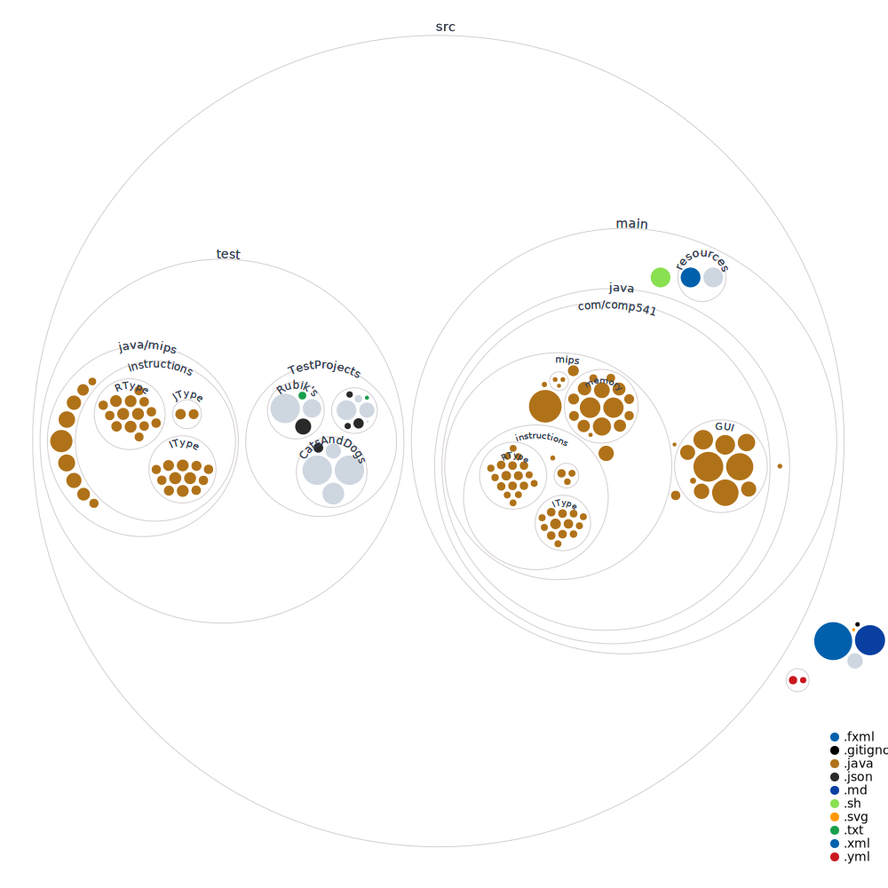

# MIPS Emulator

<p align="center">
  
</p>

MIPS Emulator is a cross-platform simulator for final projects in COMP 541 (Digital Logic and Computer Design) at [UNC](https://www.unc.edu/). It simulates customized MIPS processors using memory-mapped I/O and devices, such as accelerometer, keyboard, screen, and LED. Whereas flashing the MIPS assembly project onto the FPGA board can take upwards of 10 minutes per flash, this emulator allows for instant testing and debugging.

We ported the original [MIPS emulator](https://github.com/jordanel/mips-emulator) to Java to make the program work on any OS. Credit to [@jordanel](https://github.com/jordanel), [@jsettlem](https://github.com/jsettlem), [@swali-unc](https://github.com/swali-unc), and [@MarkovInequality](https://github.com/MarkovInequality) for their awesome work!

## Install

### macOS/Linux

```bash
curl -s "https://raw.githubusercontent.com/madiali/mips-emulator/main/src/main/sh/install.sh" | bash
```

When done, restart your terminal. You should then be able to run `mips-em` to launch MIPS Emulator. This should print out a message and open your file browser.

This script installs [SDKMAN!](https://sdkman.io) to download a compatible JDK with JavaFX (GUI dependency) bundled and set it as your default JDK. If you want to change your default JDK version when not using MIPS Emulator, see SDKMAN!'s [website](https://sdkman.io/usage).

Skip to [Usage](#usage).

### Windows

Download the JAR file from the [latest release](https://github.com/madiali/mips-emulator/releases/latest).

Then, run `java -jar <path-to-mips-emulator.jar>`. If this prints a message and opens your file browser, you're all set (skip to [Usage](#usage))! Otherwise, your Java version is incompatible, so follow the instructions below.

#### JDK 17+FX installation

You need JDK 17+ with JavaFX (GUI dependency) bundled. To download, go to [Azul's website](https://www.azul.com/downloads/?version=java-17-lts&os=windows&architecture=x86-64-bit&package=jdk-fx#zulu). This link includes tags for Java 17 (LTS), Windows x86_64, and JDK FX.

Download the `.msi` file.

<div align="center">


</div>

Double-click the `.msi`.

After you run it and click Next one time, you will be on the Custom Setup screen, where you will see a red X by the text `Set JAVA_HOME variable`. Click on it and select `Will be installed on local hard drive`.

You should now see this (no red X):

<div align="center">


</div>

Click Next and then Install (administrator permissions required). When done, click Finish.

#### Verify Java version

Open PowerShell. If you already had a session running, close it and restart. Run the following:

```powershell
echo $env:JAVA_HOME
java --version
```

You should see something like

```text
C:\Program Files\Zulu\zulu-17\
openjdk 17.0.8.1 2023-08-24 LTS
OpenJDK Runtime Environment Zulu17.44+53-CA (build 17.0.8.1+1-LTS)
OpenJDK 64-Bit Server VM Zulu17.44+53-CA (build 17.0.8.1+1-LTS, mixed mode, sharing)
```

If so, run `java -jar <path-to-mips-emulator.jar>`. This should print a message and open File Explorer. If so, you're all set! Continue to [Usage](#usage).

Otherwise, your `JAVA_HOME` environment variable and `java --version` outputs are incorrect, or you just need to restart your computer. To set `JAVA_HOME`, follow this [StackOverflow answer](https://stackoverflow.com/a/6521412/18479243). The default installation path should be `C:\Program Files\Zulu\zulu-17\`, as printed above. When complete, run MIPS Emulator via `java -jar`, as mentioned in the previous paragraph. If this still does not work, restart your computer and try again.

## Usage

Create a directory with a **required** configuration `.json` file and
your project's `.mem` files. You will be prompted to load a JSON file when the application runs.

<p align="center">
   
</p>

<p align="center">Example project structure - <a href="src/test/TestProjects/CatsAndDogs">CatsAndDogs</a></p>

<p align="center">
   
</p>

<p align="center"><a href="src/test/TestProjects/CatsAndDogs/catsAndDogs.json">catsAndDogs.json</a></p>

You can find an example JSON file `catsAndDogs.json` at the link above.
Modify the `.json` for your own needs. Mostly everything should stay the same, but at minimum,
you need to provide the names of your `.mem` files.

You can create additional Data Memory mappings to view mapped data memory values in the emulator.
See [Rubik's](src/test/TestProjects/Rubik's/rubiks.json) for an example.

There are more examples of project JSON files in the OG [MIPS emulator repo](https://github.com/jordanel/mips-emulator/tree/master/projects).
Specifically, [full_test](https://github.com/jordanel/mips-emulator/tree/master/projects/full_test) is a great place to start.
However, note that we have not implemented `Sound` in this emulator, so don't map `Sound` in a JSON file for our emulator.
Similarly, don't map `AccelerometerX` or `AccelerometerY` (just use `Accelerometer`, which has all the
capabilities of both `AccelerometerX` and `AccelerometerY`).

This should be all you need. For more advanced capabilities, see [Project files](#project-files).

## Issues

Report issues (e.g., bug report, feature request, usage question) at [Issues](https://github.com/madiali/mips-emulator/issues).

Before submitting a bug report, please check the [Known bugs and limitations](https://github.com/madiali/mips-emulator/wiki/Known-bugs-and-limitations) page and/or search for your problem on the Issues page.

## Advanced information

The information in this section is paraphrased from the original MIPS Emulator's [README](https://github.com/jordanel/mips-emulator).

This emulator is more restrictive than the FPGAs used in the course, so cases in which something works on the board but not on the emulator may not be issues. On the other hand, anything that works on the emulator but not on the board is likely an issue and should be reported.

### Project files

A MIPS Emulator project is configured using a **required JSON file**, as described in the [Usage](#usage) section.

This JSON file contains project-level information as well as configuration and mapping information for any memory units needed by the project. A project can also include multiple memory initialization files, used to set the starting values of configured memories. Numeric values may also be passed as a hexadecimal or binary string prefixed with `0x` and `0b` respectively.

#### Project JSON file elements

- projectName: The name of your project. Will appear on the emulator title bar.
- programCounter (optional): The starting program counter value.
- memories (array): A list of all mapped memory units needed by your MIPS processor.
    - type: The class of the memory unit (see below for a list of default types).
    - name (optional): The name of the memory unit. Used for display purposes in the Memory Mapper Viewer.
    - bitmask (optional*): A bitmask representing the mapped range of the memory unit. Must follow regex `^(0|1)+x*$`
    - startAddr (optional*): The starting mapped address for the memory unit.
    - endAddr (optional*): The ending mapped address for the memory unit.
    - size (optional*): The mapped size (number of addresses) of the memory unit.
    - length (optional): The number of memory locations in the memory unit. If not present, will be set to the size of the init file.
    - wordSize (optional): The size of a word in this memory unit (defaults to 4). Determines the number of addresses between values. Must be a power of 2.
    - initFile (optional): Information about the memory initialization file for this memory unit.
        - filepath: The path to the memory initialization file (typically a .txt or .mem file).
        - format (optional): The representation of values in the memory initialization file (hex, dec, bin). Defaults to hex.

#### Additional mapping information

Arbitrarily sized memory units (InstructionMemory, DataMemory, ScreenMemory, BitmapMemory) must be configured using a length or initFile.

Any memory unit intended to be mapped and accessible to the MIPS program must have one of the following combinations of elements:
- bitmask
- startAddr
- startAddr, endAddr
- startAddr, size

#### Memory unit types

- InstructionMemory - Read only memory containing the instructions of the MIPS program
- DataMemory - Read/write memory containing data used by the MIPS program. Can be used in place of unimplemented memory units
- BitmapMemory - Read only memory containing the pixel values for all 16x16 bitmaps used by the MIPS program
- ScreenMemory - Read/write memory containing the bitmap values to be displayed on the screen
- Keyboard - Read only memory containing the current keyboard scan code
- ~~Sound - Read only memory containing the period of the waveform used by the sound module~~ (not implemented)
- Accelerometer - Read only memory containing the X and Y accelerometer values in the following format: `{7'b0, accelX, 7'b0, accelY}`
- ~~AccelerometerX - Read only memory containing the X value of the accelerometer module~~ (not implemented; use Accelerometer)
- ~~AccelerometerY - Read only memory containing the Y value of the accelerometer module~~ (not implemented; use Accelerometer)

## Code structure


